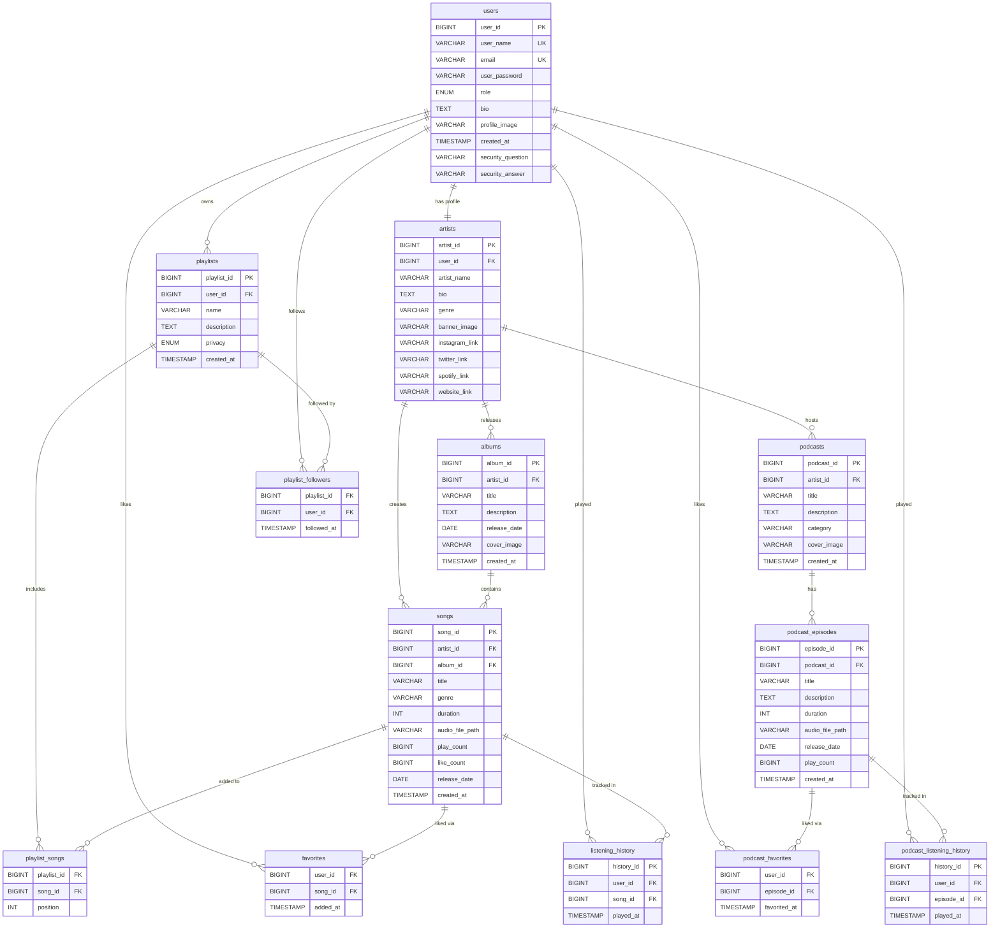

# 🎵 RevPlay

> A full-stack music streaming web application built with **Spring Boot**, **Thymeleaf**, and **MySQL** — supporting songs, albums, podcasts, playlists, and artist analytics in a unified platform.

---

## 📌 Table of Contents

- [Overview](#overview)
- [Features](#features)
- [Tech Stack](#tech-stack)
- [Project Structure](#project-structure)
- [Database Schema (ERD)](#database-schema-erd)
- [Getting Started](#getting-started)
- [API Overview](#api-overview)
- [Authentication](#authentication)

---

## Overview

RevPlay is a music streaming platform where users can register either as **Listeners** or **Artists**. Listeners can browse and play songs, follow playlists, track listening history, and save favorites. Artists can upload songs and albums, host podcasts, and view analytics on plays, likes, and follower growth.

The app runs on port `8585` and is served entirely through server-side rendered Thymeleaf templates backed by a RESTful Spring Boot API.

---

## Features

### 👤 Users
- Register as a **Listener** or **Artist**
- Secure login with **JWT authentication** (stored client-side)
- Password hashing via **BCrypt**
- Account recovery via security question & answer
- Profile management with bio and profile image

### 🎵 Music (Listener)
- Browse and play songs with an in-page audio player
- Save songs to **Favorites**
- Add songs to personal **Playlists** (public or private)
- Follow playlists created by other users
- Full **listening history** tracking
- Global search across songs, albums, artists, and playlists

### 🎤 Artists
- Upload songs (audio file + metadata)
- Create and manage **Albums**
- Host **Podcasts** with individual episodes
- View **Artist Analytics** — play counts, like counts, top songs, follower stats
- Edit artist profile with social media links (Instagram, Twitter, Spotify, website)

### 🎙️ Podcasts
- Browse podcasts by artist
- Play individual episodes
- Save episodes to podcast favorites
- Podcast listening history tracked separately from song history

---

## Tech Stack

| Layer | Technology |
|---|---|
| Language | Java 17 |
| Framework | Spring Boot 3.5 |
| ORM | Spring Data JPA / Hibernate |
| Templating | Thymeleaf |
| Frontend | Bootstrap 5, Bootstrap Icons, Vanilla JS |
| Database | MySQL 8 |
| Authentication | JWT (JJWT 0.11.5) + BCrypt |
| Logging | Log4j2 |
| Build | Maven |
| Testing | JUnit 4, Mockito |

---

## Project Structure

```
src/
└── main/
    ├── java/com/revature/Revplay/
    │   ├── config/          # Spring Security & Web configuration
    │   ├── controller/      # MVC view controllers + REST API controllers
    │   ├── dto/             # Data Transfer Objects
    │   ├── entity/          # JPA entities + composite keys
    │   ├── exception/       # Global exception handler
    │   ├── media/           # File upload & media serving service
    │   ├── repository/      # Spring Data JPA repositories
    │   ├── security/        # JWT filter & utility
    │   └── service/         # Business logic (interfaces + impl)
    └── resources/
        ├── templates/       # Thymeleaf HTML pages
        ├── static/          # CSS & JS assets
        └── application.properties
```

---

## Database Schema (ERD)



---

## Getting Started

### Prerequisites

- Java 17+
- Maven 3.8+
- MySQL 8+

### 1. Clone the repository

```bash
git clone https://github.com/your-username/revplay.git
cd revplay
```

### 2. Set up the database

```sql
CREATE DATABASE revplayMusic;
```

Then run the full schema from `schema.sql` (or the provided DDL script) against your MySQL instance.

### 3. Configure application properties

Edit `src/main/resources/application.properties`:

```properties
spring.datasource.url=jdbc:mysql://localhost:3306/revplayMusic
spring.datasource.username=your_username
spring.datasource.password=your_password
```

### 4. Run the application

```bash
./mvnw spring-boot:run
```

The app will be available at **http://localhost:8585**

---

## API Overview

| Domain | Base Path | Description |
|---|---|---|
| Auth | `/auth/**` | Register, login |
| Users | `/api/users/**` | Profile management |
| Songs | `/api/songs/**` | CRUD, play tracking |
| Albums | `/api/albums/**` | Album management |
| Artists | `/api/artists/**` | Artist profiles, followers |
| Playlists | `/api/playlists/**` | Create, manage, follow playlists |
| Favorites | `/api/favorites/**` | Like/unlike songs |
| Podcasts | `/api/podcasts/**` | Podcast & episode management |
| Search | `/api/search/**` | Global search |
| Analytics | `/api/analytics/**` | Artist play/like/follower stats |
| Media | `/media/**` | File upload & streaming |

---

## Authentication

RevPlay uses **JWT-based authentication**. On login, the server returns a signed JWT token containing the user's ID, email, and role. The token is stored client-side and attached to subsequent API requests.

- Tokens expire after **10 hours**
- Passwords are hashed using **BCrypt** before storage
- Account recovery uses a **security question & answer** set at registration

---

## Pages

| Page | Route | Description |
|---|---|---|
| Landing | `/` | Public landing page |
| Register | `/register` | New user signup |
| Login | `/login` | User login |
| Dashboard | `/dashboard` | Listener home feed |
| Profile | `/profile` | User profile & settings |
| Artist Dashboard | `/artist-dashboard` | Artist upload & management |
| Artist Detail | `/artist/{id}` | Public artist page |
| Album Detail | `/album/{id}` | Album page with tracklist |
| Song Detail | `/song/{id}` | Song page with player |
| Podcast Detail | `/podcast/{id}` | Podcast with episode list |
| Playlists | `/playlists` | User's playlist library |
