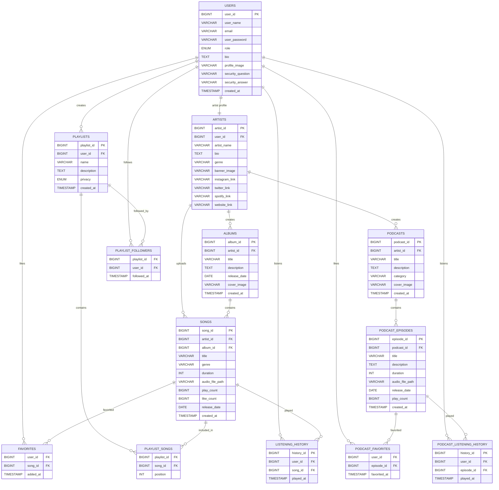

```mermaid
erDiagram

    USERS {
        BIGINT user_id PK
        VARCHAR user_name
        VARCHAR email
        VARCHAR user_password
        ENUM role
        TEXT bio
        VARCHAR profile_image
        VARCHAR security_question
        VARCHAR security_answer
        TIMESTAMP created_at
    }

    ARTISTS {
        BIGINT artist_id PK
        BIGINT user_id FK
        VARCHAR artist_name
        TEXT bio
        VARCHAR genre
        VARCHAR banner_image
        VARCHAR instagram_link
        VARCHAR twitter_link
        VARCHAR spotify_link
        VARCHAR website_link
    }

    ALBUMS {
        BIGINT album_id PK
        BIGINT artist_id FK
        VARCHAR title
        TEXT description
        DATE release_date
        VARCHAR cover_image
        TIMESTAMP created_at
    }

    SONGS {
        BIGINT song_id PK
        BIGINT artist_id FK
        BIGINT album_id FK
        VARCHAR title
        VARCHAR genre
        INT duration
        VARCHAR audio_file_path
        BIGINT play_count
        BIGINT like_count
        DATE release_date
        TIMESTAMP created_at
    }

    PODCASTS {
        BIGINT podcast_id PK
        BIGINT artist_id FK
        VARCHAR title
        TEXT description
        VARCHAR category
        VARCHAR cover_image
        TIMESTAMP created_at
    }

    PODCAST_EPISODES {
        BIGINT episode_id PK
        BIGINT podcast_id FK
        VARCHAR title
        TEXT description
        INT duration
        VARCHAR audio_file_path
        DATE release_date
        BIGINT play_count
        TIMESTAMP created_at
    }

    FAVORITES {
        BIGINT user_id FK
        BIGINT song_id FK
        TIMESTAMP added_at
    }

    PODCAST_FAVORITES {
        BIGINT user_id FK
        BIGINT episode_id FK
        TIMESTAMP favorited_at
    }

    PLAYLISTS {
        BIGINT playlist_id PK
        BIGINT user_id FK
        VARCHAR name
        TEXT description
        ENUM privacy
        TIMESTAMP created_at
    }

    PLAYLIST_SONGS {
        BIGINT playlist_id FK
        BIGINT song_id FK
        INT position
    }

    PLAYLIST_FOLLOWERS {
        BIGINT playlist_id FK
        BIGINT user_id FK
        TIMESTAMP followed_at
    }

    LISTENING_HISTORY {
        BIGINT history_id PK
        BIGINT user_id FK
        BIGINT song_id FK
        TIMESTAMP played_at
    }

    PODCAST_LISTENING_HISTORY {
        BIGINT history_id PK
        BIGINT user_id FK
        BIGINT episode_id FK
        TIMESTAMP played_at
    }


    USERS ||--|| ARTISTS : "artist profile"
    ARTISTS ||--o{ ALBUMS : creates
    ARTISTS ||--o{ SONGS : uploads
    ARTISTS ||--o{ PODCASTS : creates

    ALBUMS ||--o{ SONGS : contains
    PODCASTS ||--o{ PODCAST_EPISODES : contains

    USERS ||--o{ FAVORITES : likes
    SONGS ||--o{ FAVORITES : favorited

    USERS ||--o{ PODCAST_FAVORITES : likes
    PODCAST_EPISODES ||--o{ PODCAST_FAVORITES : favorited

    USERS ||--o{ PLAYLISTS : creates
    PLAYLISTS ||--o{ PLAYLIST_SONGS : contains
    SONGS ||--o{ PLAYLIST_SONGS : included_in

    USERS ||--o{ PLAYLIST_FOLLOWERS : follows
    PLAYLISTS ||--o{ PLAYLIST_FOLLOWERS : followed_by

    USERS ||--o{ LISTENING_HISTORY : listens
    SONGS ||--o{ LISTENING_HISTORY : played

    USERS ||--o{ PODCAST_LISTENING_HISTORY : listens
    PODCAST_EPISODES ||--o{ PODCAST_LISTENING_HISTORY : played
```
